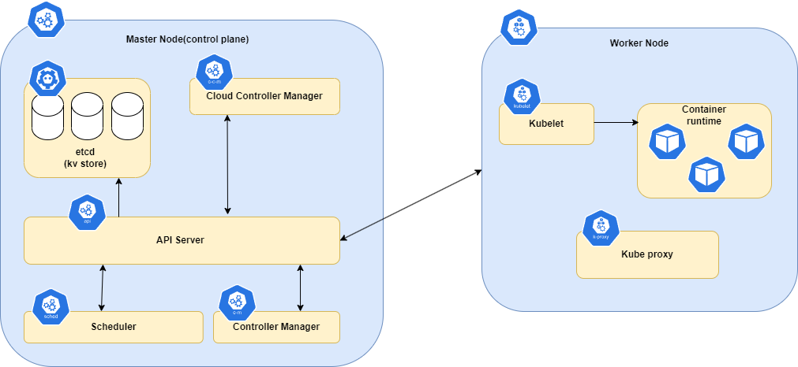

# Chapter 03. 쿠버네티스 구축하기

# 3.1 클러스터 아키텍처

## 클러스터란?

- 단일 시스템으로 작동하기 위해, 서로 연결된 서버들의 그룹
    - 서버는 노드라고도 불리는데, 여기서 노드는 unit of computing을 의미한다. 앞으로는 서버대신 노드로 표현할 것이다. 왜냐하면 서버 A가 서버 B로 데이터를 요청한다면 서버 A는 클라이언트가 되는데, 이는 독자가 글을 읽다보면 혼란을 느낄 수 있기 때문이다.
    - 노드는 물리 서버가 될 수도 있고, 가상 서버가 될 수 있음

- 클러스터는 주로 단일 머신에서 해결할 수 없는 복잡한 task 처리나 고가용성, 확장성을 위해 사용된다.(e.g. 딥러닝, 트래픽이 높은 애플리케이션)

쿠버네티스 아키텍처

책에서 기술하는 아키텍처의 컴포넌트가 상당히 생략됐기 때문에 아래의 링크를 참고

- [https://kubernetes.io/docs/concepts/architecture/](https://kubernetes.io/docs/concepts/architecture/)

책에서 언급된 컴포넌트를 바탕으로 쿠버네티스 아키텍처를 그림으로 구성하면 위와 같으며, 이 아키텍처를 구성하는 컴포넌트를 차례대로 설명하면 아래와 같다.

# 3.2 Master Node(Control plane)

- 쿠버네티스 클러스터의 두뇌 역할을 하며, 전체 시스템을 조정, 관리를 담당
- 컨테이너 워크로드를 스케줄링하는 프로세스, 클러스터 health를 관리하는 프로세스, 원하는 시스템의 상태를 유지하는 프로세스를 실행

## 3.2.1 API server

- 쿠버네티스 API 제공
- 사용자와 다른 컴포넌트의 요청을 처리하고 관리하는 것을 담당

## 3.2.2 Scheduler

- 제약사항(e.g. 사용가능한 리소스, 워크로드 요구사항 등)을 기반으로 워크로드를 worker node에 할당

## 3.2.3 Controller Manager

- deployment controller, replica set controller 등 다양한 컨트롤러를 다룬다.

## 3.2.4 Cloud Controller Manager

- 쿠버네티스 클러스터와 클라우드 회사의 API 사이의 상호작용을 관리
- 쿠버네티스를 프로비저닝하고, 클라우드 리소스(e.g. vm, lb, storage volume) 관리할 수 있게함

# 3.3 Worker Node(Data plane)

- 컨테이너화된 워크로드를 실행
- 각 worker node는 도커와 같은 컨테이너 런타임을 실행하며, 런타임은 master node에 의해 관리

## 3.3.1 Kubelet

- 실행 중인 컨테이너를 관리하기 위해 master node와 통신
- Pod 관리, 컨테이너 관리, 이미지 관리, 볼륨 관리 담당
- worker node의 상태를 정기적으로 API server에 전송
- 컨테이너가 허가된 자원에만 접근 할 수 있도록 관리

## 3.3.2 Container Runtime

- 컨테이너를 실행, 관리하는 것을 담당
    - 이미지 관리
    - 컨테이너 생성 및 관리
    - 리소스 할당
    - 네트워크 관리

## 3.3.3 Kube Proxy

- 네트워크 프록시, lb
- 트래픽이 목적지에 정확하게 도달할 수 있도록 안내함
    - IP table 사용
- 다수의 replica를 갖는 서비스를 위해, 로드밸런싱을 제공
    - 라운드 로빈 또는 최소 연결등의 lb 알고리즘 사용
- 서비스 디스커버리
    - core dns같은 dns 서비스 안에서, dns 엔트리를 갱신함 → ip주소 대신, 이름으로 서비스에 접근 할 수 있음